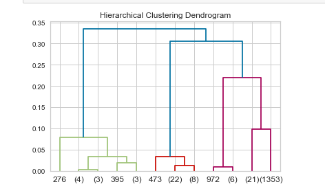

# Melbourne Development Activity Monitoring

## Project Overview
This repository contains an analytical project focused on understanding the development activities within Melbourne for the year 2013. We use advanced clustering techniques, including K-Means, Hierarchical Clustering, and DBSCAN, to extract meaningful insights that could help in urban planning and development forecasting. The project leverages Python's robust libraries such as `sklearn`, `matplotlib`, and `scipy` to process and visualize the data.

## Techniques Used
- **K-Means Clustering**: For identifying similar groups based on development features.
- **Hierarchical Clustering**: To explore the hierarchical relationship between development projects.
- **DBSCAN**: Used for identifying outliers and core groups in spatial data.

## Visualization
Below is an example of a dendrogram created as part of our Hierarchical Clustering analysis. This visualization helps in understanding the linkage between various development projects.

## Repository Structure
- `output/figures`: Contains all generated figures and plots including the dendrogram shown above.
- `src`: Includes Python scripts for preprocessing, analysis, and visualization.
- `data`: Contains the dataset used in the analyses.

## Running the Code
To run the analysis scripts, ensure you have Python installed along with the necessary libraries:

